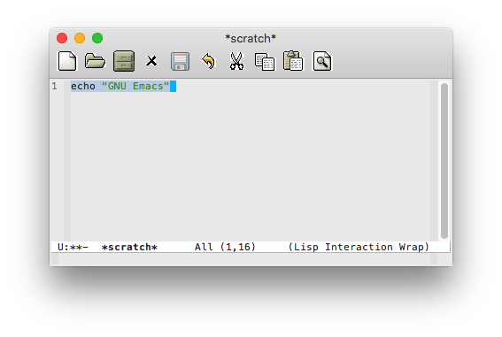
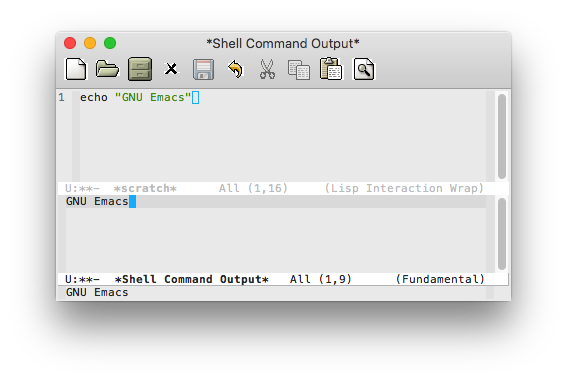
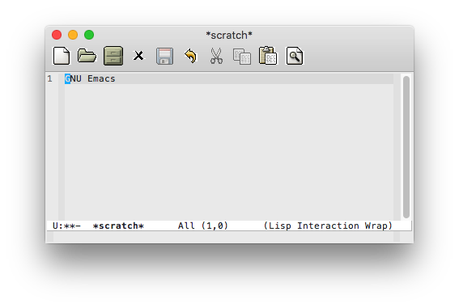

# Acme-like `shell-command` Additions for Emacs

Extends the built-in `shell-command` functions by adding some new ones inspired by the external command functionality in the [Acme text editor](https://en.wikipedia.org/wiki/Acme_\(text_editor\)). See [A Tour of the Acme Editor](https://www.youtube.com/watch?v=dP1xVpMPn8M) at around 7:20 for a demo of what Acme does.

## Commands

### `shell-command-region`

Behaves like Acme: it takes the contents of the region, executes them as a shell command, and puts the output in a temporary buffer. Commands can be called asynchronously by appending a `&` at the end of them or by using `async-shell-command-region` instead.

### `shell-command-replace-region`

Similar to `shell-command-region`, but it replaces the contents of the region with the output of the shell command instead of putting the output in a temporary buffer. This function always calls commands synchronously even if the command uses `&`.

### `async-shell-command-region`

Behaves like `shell-command-region` but runs the command asynchronously. This is particularly useful for commands that will take awhile to run.

## Example Usage

To invoke these commands in a similar way to how it's done in Acme, simply bind them to mouse buttons as you like. For example:

```lisp
(global-set-key (kbd "<mouse-3>") 'shell-command-region)
(global-set-key (kbd "<mouse-4>") 'shell-command-replace-region)
(global-set-key (kbd "<mouse-4>") 'async-shell-command-region)
```

With one or more of those bindings in place, it can be useful to put commands, say `build-project.sh`, into an [Org Mode](https://orgmode.org/) or other project file to run a frequently used command from Emacs at the click of your mouse.

## Screenshots







## License

&copy; 2014, 2017, 2020 Tim Baumgard. These functions are licensed under [GPL v3.0](https://www.gnu.org/licenses/gpl-3.0-standalone.html).
